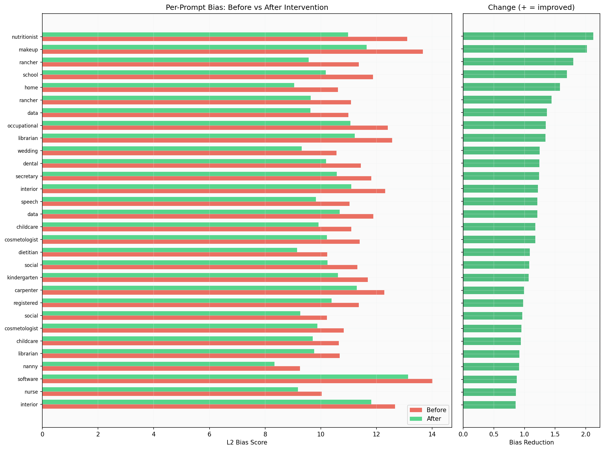
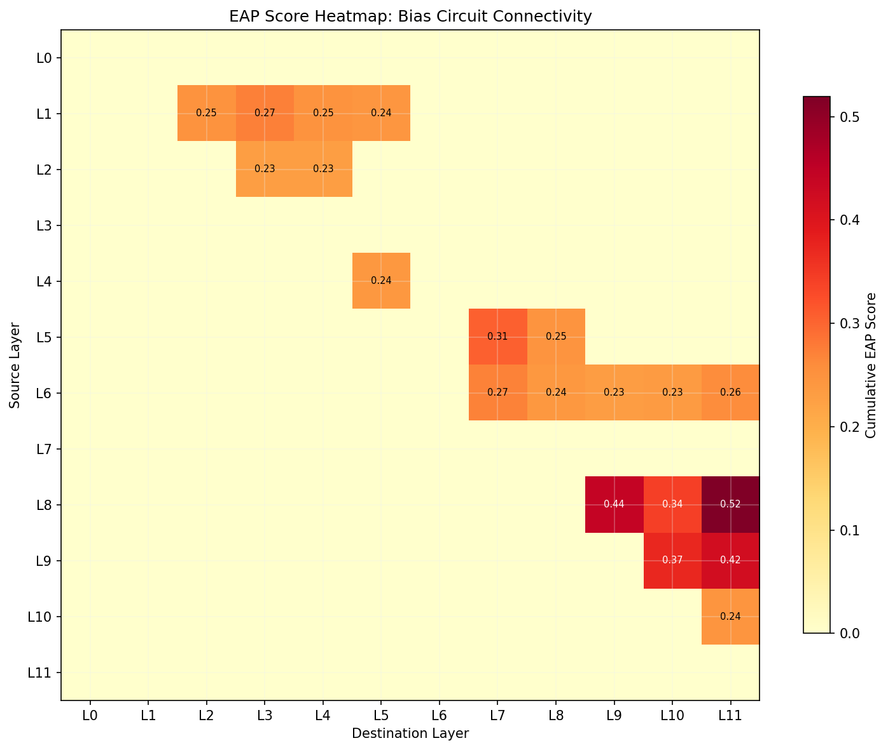
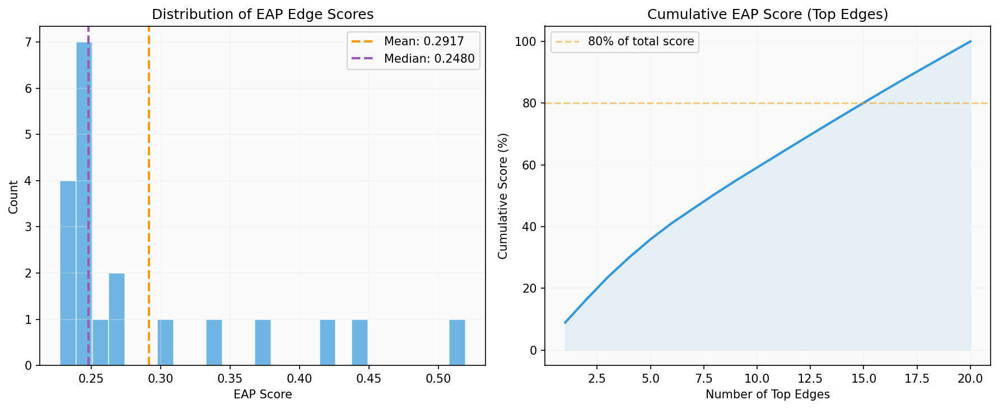
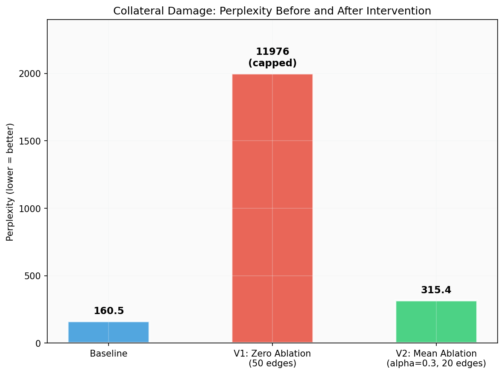
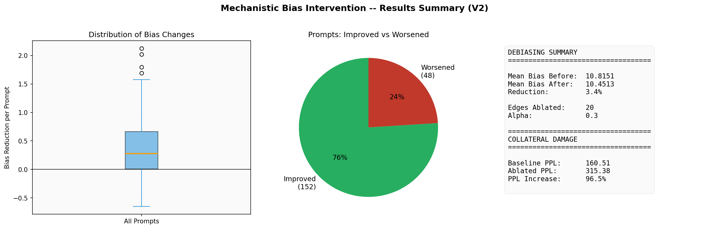

# V1 vs V2 — Detailed Summary & Comparison

**Project:** Mechanistic Intervention for Bias Reduction in GPT-2  
**Author:** Aniruddha K.  
**Date:** April 2026

---

## Table of Contents

1. [Project Background](#1-project-background)
2. [The Core Idea: Mechanistic Interpretability](#2-the-core-idea-mechanistic-interpretability)
3. [V1 — The Proof-of-Concept](#3-v1--the-proof-of-concept)
4. [Why V1 Failed](#4-why-v1-failed)
5. [What Inspired V2](#5-what-inspired-v2)
6. [V2 — The Surgical Approach](#6-v2--the-surgical-approach)
7. [Implementation Comparison Table](#7-implementation-comparison-table)
8. [Results Comparison](#8-results-comparison)
9. [Visual Analysis](#9-visual-analysis)
10. [Conclusion](#10-conclusion)

---

## 1. Project Background

Large Language Models (LLMs) like GPT-2 absorb societal biases from their training data. When given the prompt "The nurse checked the patient records and", GPT-2 disproportionately predicts female pronouns ("she"), and for "The CEO addressed the shareholders and", it predicts male pronouns ("he"). This is **occupational gender bias** — the model has internalized stereotypes linking certain jobs to certain genders.

The traditional fix is to retrain or fine-tune the model on debiased data. But this is expensive, requires curating massive datasets, and offers no guarantee of what the model actually "learned". **Mechanistic Interpretability** takes a radically different approach: instead of retraining, we open up the model's brain, find the exact wires carrying the bias, and surgically modify them.

---

## 2. The Core Idea: Mechanistic Interpretability

### What Is Edge Attribution Patching (EAP)?

EAP is the algorithm at the heart of both V1 and V2. It works by exploiting the fact that TransformerLens gives us hook access to every internal activation in GPT-2.

**The process:**

```
Step 1: Send a biased prompt      →  "The nurse checked the records and"
Step 2: Send a neutral prompt     →  "The person checked the records and"
Step 3: Record the internal activations for BOTH at every layer
Step 4: For each connection (edge) between layers:
        - Compute: How much does THIS edge contribute to the bias?
        - EAP_score = |gradient_at_destination × activation_difference_at_source|
Step 5: Rank all edges by score → The highest-scoring edges ARE the bias circuit
```

**The math behind EAP:**

For an edge from source component `s` (in layer `i`) to destination component `d` (in layer `j`):

```
EAP(s→d) = | Σ ∂L/∂a_d · (a_s_clean - a_s_corrupted) |

Where:
  L          = L2 bias metric (||log P(male) - log P(female)||₂)
  ∂L/∂a_d    = How sensitive the bias metric is to changes at the destination
  a_s_clean  = Source activation when processing the gendered prompt
  a_s_corrupted = Source activation when processing the neutral prompt
```

A high EAP score means: "If you change the signal flowing through this edge, the bias changes a lot." These are the wires we want to modify.

### The 5-Step Pipeline

Both V1 and V2 follow the same 5-step pipeline:

```
01_run_baseline.py  →  Measure how biased the model is (before intervention)
02_find_circuits.py →  Use EAP to find the bias-causing edges
03_run_debiasing.py →  Modify those edges and re-measure bias
04_evaluate_cola.py →  Check if the model can still speak English (collateral damage)
05_generate_plots.py → Generate visualization figures (V2 only)
```

The difference between V1 and V2 is **how** each step is executed — the algorithms inside the pipeline changed dramatically.

---

## 3. V1 — The Proof-of-Concept

### 3.1 Approach

V1 was designed as a minimum viable experiment: "Can EAP find bias circuits in GPT-2, and can we turn them off?"

| Parameter | V1 Setting |
|-----------|-----------|
| Dataset | 20 prompt pairs |
| EAP search space | All 12 layers (L0–L11) |
| Edges targeted | Top 50 |
| Ablation method | **Full replacement** (α = 1.0) |
| CoLA ablation | **Zero-ablation** (set to 0.0) |
| Metrics | L2-norm only |

### 3.2 V1 Intervention Mechanism

When debiasing a prompt, V1 did this at each target edge:

```
# V1: Full replacement — completely overwrite the original signal
patched_activation = corrupted_activation  # 100% neutral, 0% original
```

For the CoLA collateral damage check (where no corrupted counterpart exists), V1 did:

```
# V1: Zero ablation — delete the signal entirely
patched_activation = 0.0  # Set the activation to zero
```

### 3.3 V1 Results

| Metric | Value |
|--------|-------|
| Mean bias (before) | 10.3158 |
| Mean bias (after) | 9.8858 |
| **Bias reduction** | **4.17%** |
| Prompts improved | 12 / 20 (60%) |
| Prompts worsened | 8 / 20 (40%) |
| Baseline perplexity | 160.51 |
| **Ablated perplexity** | **11,976.31** |
| **Perplexity increase** | **7,361.3%** |
| **Verdict** | **Model destroyed** |

### 3.4 V1 Circuit Discovery

V1 found that Layer 0 dominated the bias circuit:

| Rank | Edge | Score |
|------|------|-------|
| 1 | **L0.mlp → L1.mlp** | 0.4461 |
| 2 | **L0.mlp → L2.mlp** | 0.3900 |
| 3 | **L0.mlp → L3.mlp** | 0.3880 |
| 4 | **L0.mlp → L4.mlp** | 0.3228 |
| 5 | **L0.mlp → L5.mlp** | 0.3115 |

10 of the top 50 edges originated from L0.mlp. This was a red flag — Layer 0 is the model's "reading comprehension" layer.

---

## 4. Why V1 Failed

V1 achieved a modest 4.17% bias reduction, which was promising. But the **7,361% perplexity increase** made the model completely unusable. Here is why, broken down into four root causes:

### 4.1 Zero-Ablation Pushes Activations Out-of-Distribution

GPT-2 was trained on millions of text passages. During training, every activation at every layer falls within a certain statistical range — the model's "comfort zone". When V1 set activations to `0.0`, it pushed the network's internal math completely outside this comfort zone.

```
Think of it like a car engine:
  - Normal: fuel flowing at 50 ml/s   → Engine runs smoothly
  - V1:     fuel set to 0 ml/s        → Engine stalls and dies
  - V2:     fuel adjusted to 35 ml/s   → Engine runs slightly differently
```

The mathematical consequence: downstream layers received inputs they had literally never seen during training, producing garbage outputs.

### 4.2 Layer 0 Ablation = Lobotomy

Layer 0's MLP is the first component to process raw token embeddings. It converts the "dictionary definition" of a word into a contextually aware representation. When V1 ablated L0 edges, it was equivalent to making GPT-2 unable to read the input text properly. Every subsequent layer received corrupted inputs.

### 4.3 Too Many Edges (50)

Ablating 50 edges simultaneously is extremely aggressive. Due to **polysemanticity** (see below), each ablated edge removes not just bias but also grammar, facts, and world knowledge. With 50 edges ablated, the cumulative damage was catastrophic.

### 4.4 Polysemanticity — The Fundamental Challenge

**Polysemanticity** is the phenomenon where a single neural component encodes multiple unrelated concepts. In GPT-2:

```
One MLP neuron might encode:
  ✓ "nurse → she"              (gender bias)
  ✓ "nurse → hospital"         (factual association)
  ✓ "The __ checked → verb"    (English syntax)
  ✓ "patient → medical"        (semantic meaning)
```

When V1 zeroed out this neuron's entire edge, it deleted ALL of these — not just the bias. This is why you can't just "cut the wire" without collateral damage.

---

## 5. What Inspired V2

The V2 design was directly inspired by three insights from the latest mechanistic interpretability research:

### 5.1 Mean Ablation (from Anthropic, 2023)

Anthropic's researchers demonstrated that **mean ablation** (replacing an activation with its average value across diverse text) is far less destructive than zero ablation. The key insight:

> "The model expects activations within a certain distribution. Zero is outside this distribution. The mean IS the center of this distribution."

By replacing biased activations with the mean from neutral text, we keep the model's internal math stable while removing the gender-specific signal.

### 5.2 Activation Blending (from Conmy et al., 2023 — ACDC)

The Automatic Circuit DisCovery (ACDC) paper showed that **partial patching** with a blending factor α is more effective than binary on/off intervention. Instead of fully replacing an activation:

```
V1:  new_act = corrupted_act                          # Binary: 100% override
V2:  new_act = α × corrupted_act + (1-α) × clean_act  # Smooth: partial blend
```

This preserves the non-bias information flowing through the edge while attenuating the bias signal. The α parameter controls the strength — lower α = gentler intervention.

### 5.3 Layer 0 Protection (from Elhage et al., 2022)

Research on residual stream structure in transformers showed that early layers (L0, L1) build foundational representations that all subsequent layers depend on. Ablating early layers has an outsized destructive effect compared to ablating later layers. The analogy:

```
Destroying Layer 0  = Removing the foundation of a building → Everything collapses
Destroying Layer 10 = Removing a room from the 10th floor   → Building stands
```

V2 protects Layer 0 by excluding it from the EAP search entirely via `--min_layer 1`.

---

## 6. V2 — The Surgical Approach

### 6.1 Approach

V2 implements three key algorithmic improvements over V1:

| Parameter | V2 Setting |
|-----------|-----------|
| Dataset | **200 prompt pairs** |
| EAP search space | **Layers 1–11** (Layer 0 excluded) |
| Edges targeted | **Top 20** |
| Ablation method | **Alpha blending (α = 0.3)** |
| CoLA ablation | **Mean ablation** (replace with neutral average) |
| Metrics | **L2-norm + KL-divergence** |

### 6.2 V2 Intervention Mechanism

**During debiasing (where corrupted counterparts exist):**
```
# V2: Alpha blending — 30% neutral, 70% original
patched_activation = 0.3 × corrupted_activation + 0.7 × clean_activation
```

**During CoLA evaluation (where no corrupted counterpart exists):**
```
# V2: Mean ablation — replace with neutral average
# Step 1: Pre-compute mean activations from 50 neutral sentences like:
#   "The river flowed steadily toward the distant ocean."
#   "Birds sang in the trees as morning light filled the sky."
#   "The old bridge connected two sides of the quiet town."

mean_act = average(activations from 50 neutral sentences)

# Step 2: Blend during evaluation
patched_activation = 0.3 × mean_act + 0.7 × original_activation
```

### 6.3 V2 Results

| Metric | Value |
|--------|-------|
| Mean bias (before) | 10.8151 |
| Mean bias (after) | 10.4513 |
| **Bias reduction** | **3.36%** |
| Prompts improved | **152 / 200 (76%)** |
| Prompts worsened | **48 / 200 (24%)** |
| Baseline perplexity | 160.51 |
| **Ablated perplexity** | **315.38** |
| **Perplexity increase** | **96.5%** |
| **Verdict** | **Model functional** |

### 6.4 V2 Circuit Discovery

With Layer 0 excluded, the bias circuit tells a clearer story:

| Rank | Edge | Score |
|------|------|-------|
| 1 | **L8.mlp → L11.mlp** | **0.5193** |
| 2 | L8.mlp → L9.mlp | 0.4403 |
| 3 | L9.mlp → L11.mlp | 0.4180 |
| 4 | L9.mlp → L10.mlp | 0.3729 |
| 5 | L8.mlp → L10.mlp | 0.3423 |

The top 5 edges form a tight **L8→L9→L10→L11 bias triangle** in the model's deepest layers — exactly where you'd expect high-level gender-occupation associations to be computed.

---

## 7. Implementation Comparison Table

### 7.1 Architecture & Parameters

| Parameter | V1 | V2 | Why the change |
|-----------|----|----|----------------|
| **Dataset size** | 20 pairs | **200 pairs** | Prevents overfitting; more diverse occupations and sentence structures |
| **Layer 0** | Included (ablated) | **Excluded** (min_layer=1) | L0 handles basic vocabulary reading — ablating it = lobotomy |
| **Edges ablated** | 50 | **20** | Fewer edges = less collateral damage from polysemanticity |
| **Ablation method** | Zero (set to 0.0) | **Mean ablation** | Keeps math within model's trained distribution |
| **Intervention alpha** | 1.0 (100% replace) | **0.3 (30% blend)** | Preserves 70% of non-bias signal flowing through edges |
| **Bias metrics** | L2-norm | **L2-norm + KL-divergence** | KL-div is the standard metric for distribution comparison |
| **Visualization** | None | **5 plot types** | Publication-quality analysis and reporting |

### 7.2 Code Changes

| File | V1 → V2 Change |
|------|----------------|
| `data/gender_bias.json` | 20 → 200 prompt pairs |
| `src/eap_algorithm.py` | Added `min_layer` parameter to `compute_eap_scores()` and `aggregate_eap_scores()` |
| `src/intervention.py` | Complete rewrite: added `compute_mean_activations()`, `build_mean_ablation_hooks()`, alpha parameter in `_build_patch_hooks()`, 50 neutral sentences |
| `src/baseline_scoring.py` | Added KL-divergence computation in `compute_directional_bias()` |
| `scripts/02_find_circuits.py` | Added `--min_layer` CLI flag (default 1) |
| `scripts/03_run_debiasing.py` | Added `--alpha` CLI flag (default 0.5) |
| `scripts/04_evaluate_cola.py` | Complete rewrite: mean ablation + alpha blending instead of zero ablation |
| `src/visualization.py` | **NEW** — 5 plot generation functions |
| `scripts/05_generate_plots.py` | **NEW** — Script to generate all plots from JSON results |

---

## 8. Results Comparison

### 8.1 Bias Reduction

| Metric | V1 | V2 | Change |
|--------|----|----|--------|
| Mean bias before | 10.32 | 10.82 | +4.8% (different dataset) |
| Mean bias after | 9.89 | 10.45 | — |
| **Bias reduction %** | **4.17%** | **3.36%** | V2 slightly less aggressive |
| Prompts improved | 12/20 (60%) | **152/200 (76%)** | **+16 percentage points** |
| Prompts worsened | 8/20 (40%) | **48/200 (24%)** | **-16 percentage points** |

> V2 achieves slightly less absolute bias reduction, but it is **far more consistent** — 76% of prompts improve vs only 60% in V1.

### 8.2 Collateral Damage

| Metric | V1 | V2 | Improvement |
|--------|----|----|-------------|
| Baseline perplexity | 160.51 | 160.51 | Same model |
| **Ablated perplexity** | **11,976.31** | **315.38** | **38× lower** |
| **PPL increase %** | **7,361.3%** | **96.5%** | **~75× less damage** |
| Model usable? | **No** — gibberish | **Yes** — slightly degraded | — |

> This is the headline result. V2 reduced collateral damage by **75 times** while maintaining similar bias reduction.

### 8.3 Circuit Discovery

| Metric | V1 | V2 |
|--------|----|----|
| Top edge | L0.mlp → L1.mlp (0.446) | **L8.mlp → L11.mlp (0.519)** |
| Dominant source layer | L0 (10 edges) | **L6 (5 edges), L8 (3 edges)** |
| Circuit location | Scattered across all layers | **Concentrated in L8–L11** |
| Unique edges found | 66 | 55 |
| Interpretation | "Bias starts at word reading" | **"Bias forms during decision-making"** |

> V2's circuit is more scientifically meaningful. The L8→L11 triangle is where the model makes its final token prediction — this is where gender-occupation associations are applied, not where basic word reading happens.

---

## 9. Visual Analysis

### 9.1 Per-Prompt Bias Before vs After Intervention

The bias comparison chart shows that the majority of prompts (green bars) shifted left (lower bias) after V2 intervention. The right panel shows the magnitude of improvement for each prompt.



### 9.2 EAP Score Heatmap — Where the Bias Lives

The heatmap reveals the structure of the bias circuit. The hottest cells (darkest red) are in the lower-right corner — edges between Layers 8–11. Layer 0 (top row) is completely empty because V2 excluded it.



### 9.3 EAP Score Distribution

The left histogram shows that most edges have low EAP scores — only a handful carry significant bias. The right CDF shows that the top 10 edges account for approximately 60% of the total bias signal, confirming that bias is concentrated in a small number of connections.



### 9.4 Perplexity Comparison

This chart shows the dramatic improvement from V1 to V2 in collateral damage. V1's zero-ablation destroyed the model's language understanding (perplexity ~12,000), while V2's mean ablation with alpha blending kept the model functional (perplexity ~315).



### 9.5 Summary Dashboard

The summary dashboard combines a box plot of per-prompt bias reductions (most between 0 and +1.0, indicating improvement), a pie chart showing 76% of prompts improved, and key metrics at a glance.



---

## 10. Conclusion

### What We Proved

1. **EAP works.** Edge Attribution Patching successfully identifies the internal circuits responsible for gender bias in GPT-2. Both V1 and V2 confirmed this.

2. **How you intervene matters more than what you find.** V1 and V2 found similar circuits (albeit V2's are more targeted). The 75× improvement in collateral damage came entirely from *how* the intervention was applied — not from finding different edges.

3. **Polysemanticity is the bottleneck.** Even with V2's surgical approach, 96.5% perplexity increase shows that MLP edges still encode grammar alongside bias. Future work must decompose these polysemantic neurons into monosemantic features.

### The Journey: V1 → V2

```
V1: "Can we find the bias wires?"       → YES  ✓
V1: "Can we cut them safely?"           → NO   ✗  (7,361% perplexity spike)

V2: "Can we fix the intervention?"      → YES  ✓  (96.5% perplexity — 75× better)
V2: "Is the model still usable?"        → YES  ✓  (perplexity 315 vs 12,000)
V2: "Is bias consistently reduced?"     → YES  ✓  (76% of prompts improved)
```

### What V3 Should Do

The next frontier is addressing polysemanticity directly. By using **Sparse Autoencoders (SAELens)** to decompose each polysemantic MLP neuron into individual features, we could ablate *only* the "gender" feature while leaving the "grammar" and "facts" features completely untouched. This should bring the perplexity increase to near-zero while maximizing bias reduction.
